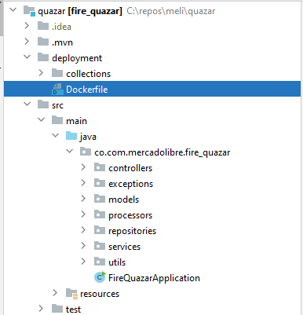

# Quasar Operation Fire
## _Rebel Alliance_

The rebel intelligence service has detected a call for help from a ship
Imperial cargo carrier adrift in an asteroid field. The ship's manifest
It is ultra classified, but is rumored to carry rations and weaponry for a
entire legion.

## The project

Web project developed with Java 11, Springboot Framework and MongoBD.
[]()
## Dependencies

| Name | version | Description |
| ------ | ------ | ------ |
| spring-boot-starter-web |  | Starter for building web, including RESTful, applications using Spring MVC. Uses Tomcat as the default embedded container|
| spring-boot-starter-test |  | Starter for testing Spring Boot applications with libraries including JUnit Jupiter, Hamcrest and Mockito|
|spring-boot-starter-data-mongodb| | Starter for using MongoDB document-oriented database and Spring Data MongoDB|
|spring-boot-starter-validation| |Starter for using Java Bean Validation with Hibernate Validator |
|lombok| |Spice up your java: Automatic Resource Management, automatic generation of getters, setters, equals, hashCode and toString, and more! |
|commons-math3 | 3.6.1 |The Apache Commons Math project is a library of lightweight, self-contained mathematics and statistics components addressing the most common practical problems not immediately available in the Java programming language or commons-lang. Library complemente to trilateration |
|commons-lang3| 3.11 | Apache Commons Lang, a package of Java utility classes for the classes that are in java.lang's hierarchy, or are considered to be so standard as to justify existence in java.lang.|
|trilateration| 1.0.2|Solves a formulation of n-D space trilateration problem using a nonlinear least squares optimizer |

## Installation App
In the folder {source_app}/deployment/Dockerfile

[]()
## Api Rest

| Method | Name Method | Path|Params|
| ------ | ------ | ------ | ------ |
| Post | responseTopSecret |/topsecret|
| Post | sendMessageToSatellite |/topsecret_split|{name_satellite}|
| Get | getMessageFromSatellite |/topsecret_split|{name_satellite}|

## Installation MongoDB - Docker 
[]()

```sh
docker run -d --name mongodb -p 127.0.0.1:27017:27017 -d mongo
```

## Configuration MongoDB
```sh
spring.data.mongodb.host=${MONGODB_HOST:192.168.0.3}
spring.data.mongodb.port=${MONGODB_PORT:27017}
spring.data.mongodb.database=${MONGODB_DATABASE:mongo}
spring.data.mongodb.repositories.enabled=true
```

| Key | description | Path|
| ------ | ------ | ------ | 
| Post | responseTopSecret |/topsecret|
| Post | sendMessageToSatellite |/topsecret_split|
| Get | getMessageFromSatellite |/topsecret_split|

[](https://travis-ci.org/joemccann/dillinger)


